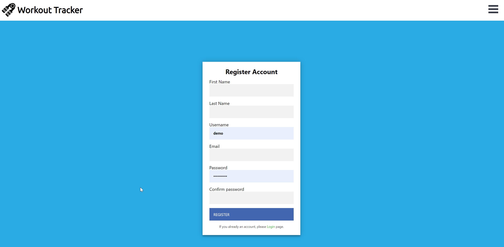
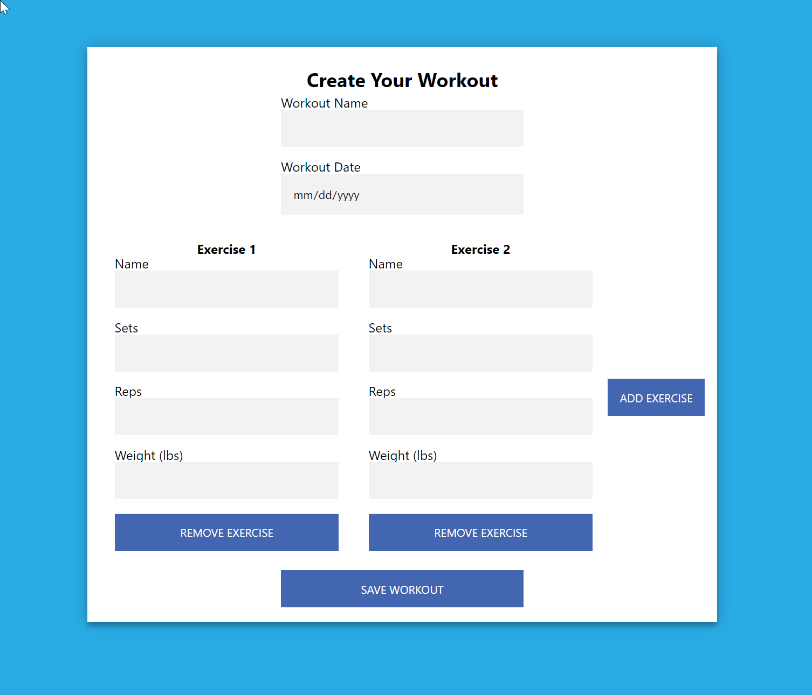
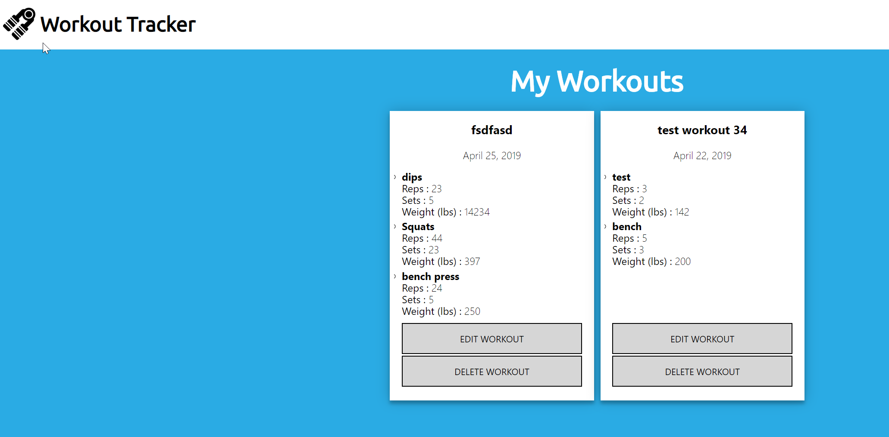

<h1>Project Description</h1>

This project focuses on working out. With this app, you can create a simple work out and update as you go along the amount of working out you are doing.

 Link to heroku live app <a href="https://enigmatic-anchorage-97005.herokuapp.com/">here</a>

<h2> Technologies used</h2>
<ul>
<li>HTML</li>
<li>Javascript/Jquery</li>
<li>CSS</li>
<li>React</li>
<li>Node.js/Express</li>
</ul>

<h2>Example of usage work flow</h2>

First register or log into system via main page

Next you will be able to create a workout

To be able to view all your workouts, you can visit the dashboard

From the dashboard you can edit or delete workouts as you please

Node Based API github can be found <a href="https://github.com/Chrolan/server-react-capstone-workout-app">here</a>

